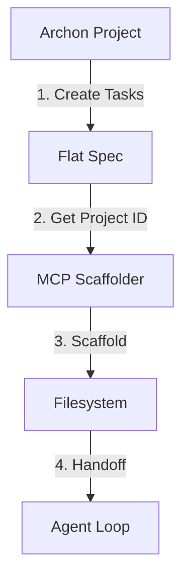
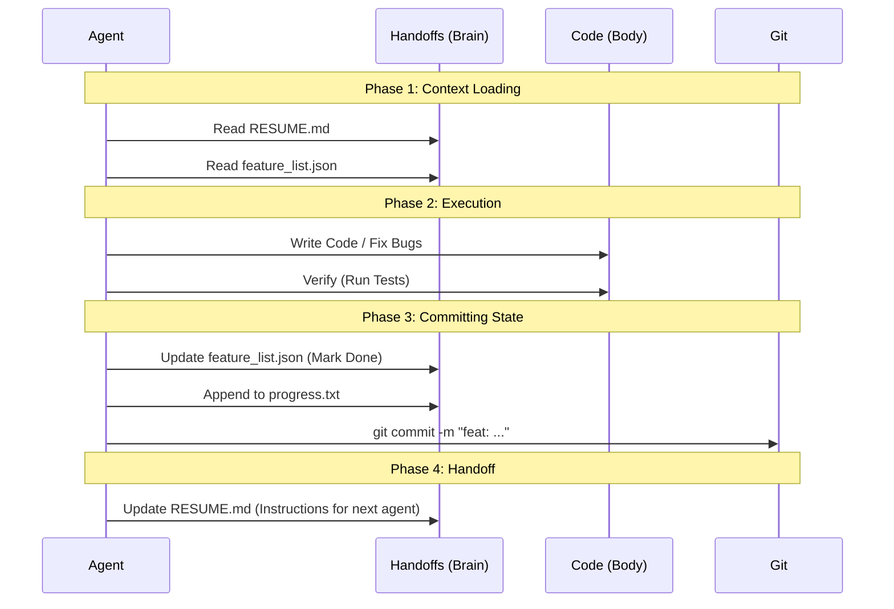

# 🛠️ How It Works: The MCP Creation Workflow

This document explains the "Standard Loop" for creating and maintaining MCP skills within this monorepo. It connects the **Plan** (Archon) to the **Code** (Filesystem) via the **Scaffolder**.

## 1. The Workflow: From Archon to Disk

The process begins with a "Flat Spec" in Archon and ends with a scaffolded project on disk.



### Step A: The Flat Spec (Archon)
In Archon, you define *what* needs to be done.
1.  **Create Project**: e.g., "Weather API".
2.  **Create Tasks**: A flat list of actionable items.
    *   *Examples:* "Research OpenMeteo", "Implement client", "Add tests".
3.  **Get ID**: Note the `project_id` (e.g., `p-123`).

### Step B: The Scaffolder
You (or an Agent) run the `mcp-scaffolder` tool with that ID.
```bash
scaffold_skill(
  skill_name="weather-api", 
  archon_project_id="p-123"
)
```

---

## 2. The Structure: "The Harness"

The scaffolder creates a standard "Harness" for every skill. This separates the **Brain** (Management) from the **Body** (Code).

| Location | Purpose | Key Files |
| :--- | :--- | :--- |
| **`handoffs/<skill>/`** | **The Brain** 🧠<br>Tracks state, history, and plans. | `feature_list.json` (Truth)<br>`RESUME.md` (Handoff)<br>`progress.txt` (Log) |
| **`mcps/<skill>/`** | **The Body** 🦾<br>Actual logic and execution. | `src/index.ts`<br>`package.json`<br>`skill.json` |

### Key Files in "The Brain"
- **`RESUME.md`**: The Bridge. It contains the **Archon Project ID**, allowing any agent to look up the original plan.
- **`feature_list.json`**: The Scoreboard. Agents update this to show what is passing.
- **`LESSONS_LEARNED.md`**: The Shared Memory. Avoids repeating mistakes.

---

## 3. The Execution Loop

Once scaffolded, the "Agent Loop" begins. This is the routine every agent follows when working on the skill.



### The "Git Loop"
The Scaffolder handles the **first** iteration automatically:
1.  **Scaffold**: Creates all files.
2.  **Stage**: `git add .`
3.  **Commit**: `git commit -m "feat: Scaffold <skill>"`

Future agents must manually continue this loop: **Code → Verify → Update Brain → Commit.**